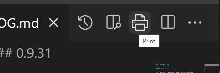
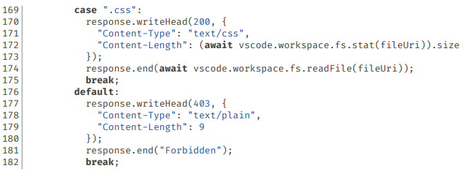
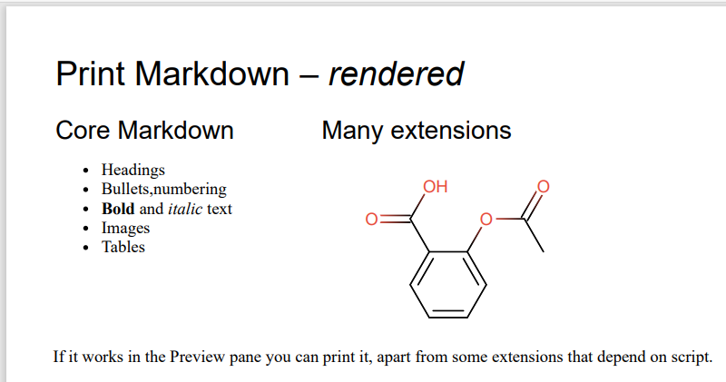
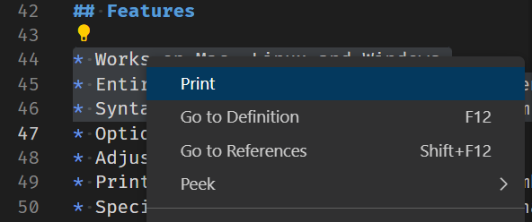
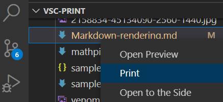

# </img> Print

[Marketplace page](https://marketplace.visualstudio.com/items?itemName=pdconsec.vscode-print)

[English version](https://github.com/PeterWone/vsc-print) by Peter Wone

[Chinese Version](https://github.com/kuriyamasss/vsc-print) by Kuriyamasss,中文版本由Kuriyamasss翻译

[ENGLISH](README.md) | [FRANCAISE](README.fra.md) | [DEUTSCH](README.deu.md) | [ESPAGNOLE](README.esp.md) | [中文CHINESE](README.zho.md) | [Add a language](how-to-add-a-language.md)

# Print, right where it belongs

 

## Cross-platform printing

Print-jobs are rendered as styled HTML and served from an embedded webserver. Your local web browser is launched to load the print-job and give you printing options like paper size, page orientation and margin size. 

So if you have a local browser that can print, and VS Code can launch it, you're in business.  

## Source code

 

## Markdown

 

## Classic user experience

The print icon on the toolbar prints the document in the active editor.

If you have a text selection that crosses at least one line-break you can right click and choose `Print` from the context menu to send just the selection to the printer. In the absence of a multi-line selection the entire document is printed. You can control the position of `Print` in this menu, or remove it altogether.

Or you can right-click on a file in the file explorer pane and choose Print from the context menu.

## Highly configurable

There are a _lot_ of settings. Most of them you just need to read the descriptions on the settings page, but we're old school and [we wrote a manual.](docs/manual.md) If things aren't going your way, maybe you should read it. And [the troubleshooting guide](docs/troubleshooting.md).

Some things you can configure:

- the colour scheme used for syntax colouring
- whether or not you want line numbers
- alternate browser for printing
- line spacing (leave yourself more room for handwritten annotation of code)
