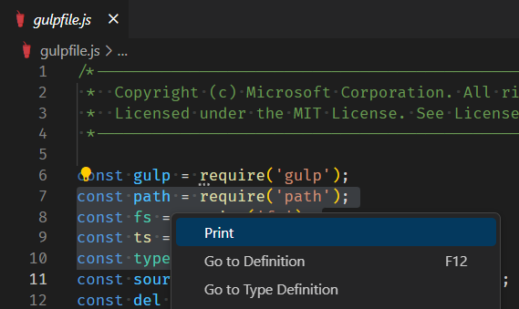

1. Open a file for editing and focus the editor. 
2. Create a multi-line selection.
3. Trigger printing in one of the following ways.
	- Click on the Print icon in the toolbar.
	- Right-click on the document and choose `Print` from the context menu.

Line numbers are preserved. For example, in the illustration lines 7 to 10 are selected. Only these lines will be printed, and they will be numbered 7 to 10.