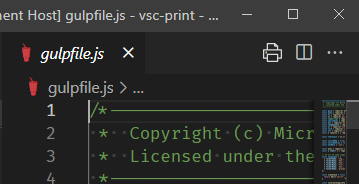

1. Open a file for editing and focus the editor. This will cause the Print icon to appear in the toolbar.
2. Do not create a multi-line text selection. If one exists, remove it. 
3. Trigger printing in one of the following ways.
	- Click on the Print icon in the toolbar.
	- Right-click on the document and choose `Print` from the context menu.

The file is printed _as it is in the editor,_ which may differ from the file on disk. You can print a file that has never been saved.