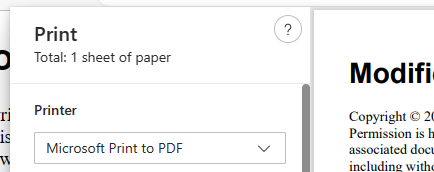

Markdown is printed formatted by default. No action is required to cause this. 

1. Trigger printing in one of the following ways.
	- Click on the Print icon in the toolbar.
	- Right-click on the document and choose `Print` from the context menu.
2. Choose a PDF printer in the print dialog of your browser. 

The browser print dialog also controls paper size, orientation, margins, and whether to show headers and footers. Content will automatically re-flow to suit changes to paper size, orientation and margins. Control of headers, footers and their content is browser specific. Consult browser documentation for details.