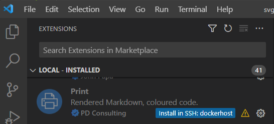

1. Install Print on the remote host by clicking the badge (see illustration) 
2. Use Print normally

Many Markdown extensions are not configured to run on the remote host. This makes them unavailable when printing Markdown from a remote workspace. If you find that a Markdown extension works locally but not remotely, ask the author to add this top-level key

      "extensionKind": ["workspace"],

to the offending extension's `package.json` file.