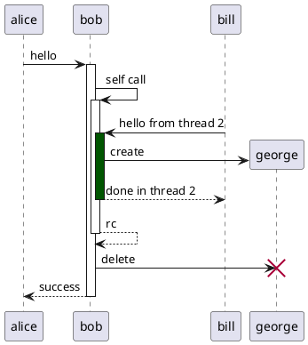
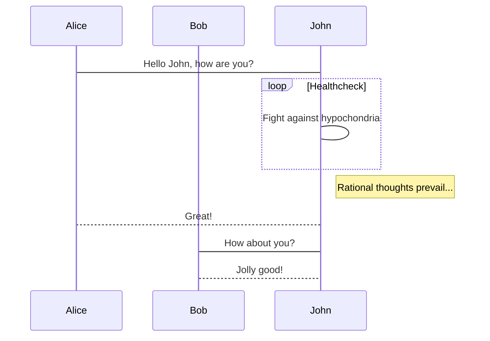

# Kroki diagrams (Simple)

## Sequence diagram (PlantUML)

```plantuml
@startuml
autoactivate on
alice -> bob : hello
bob -> bob : self call
bill -> bob #005500 : hello from thread 2
bob -> george ** : create
return done in thread 2
return rc
bob -> george !! : delete
return success
@enduml
```

## Sequence diagram (Mermaid)

```mermaid
sequenceDiagram
    participant Alice
    participant Bob
    Alice->John: Hello John, how are you?
    loop Healthcheck
        John->John: Fight against hypochondria
    end
    Note right of John: Rational thoughts prevail...
    John-->Alice: Great!
    John->Bob: How about you?
    Bob-->John: Jolly good!
```

