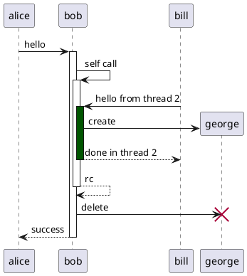
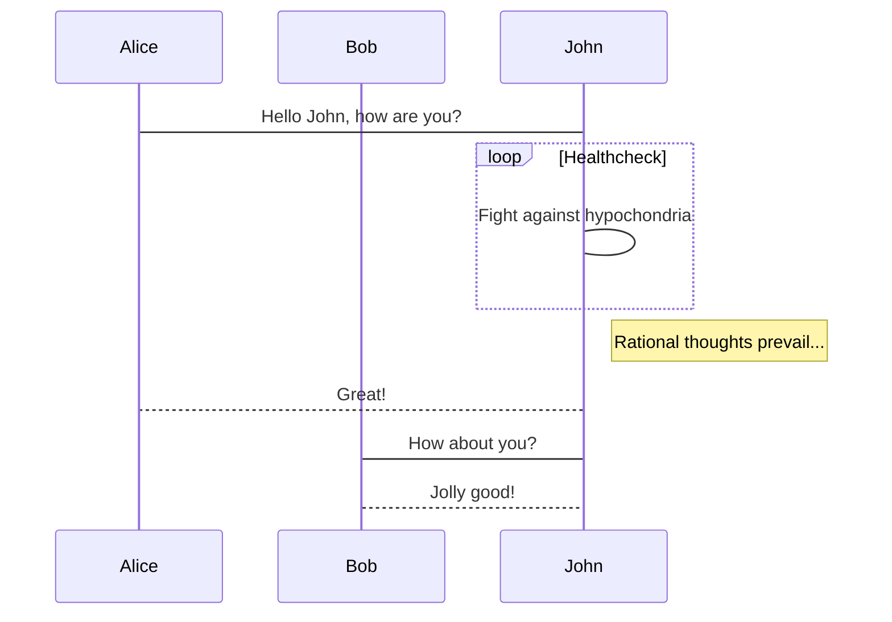
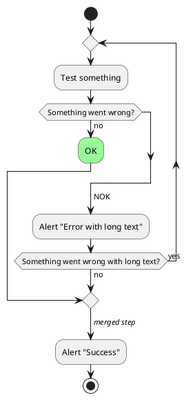
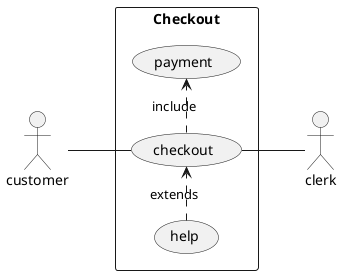
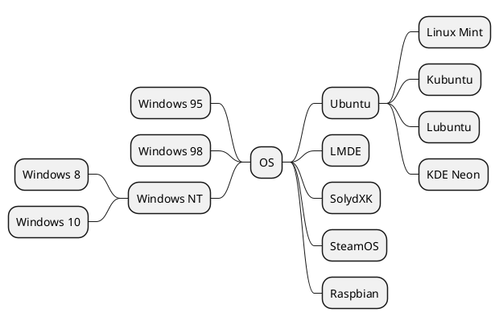
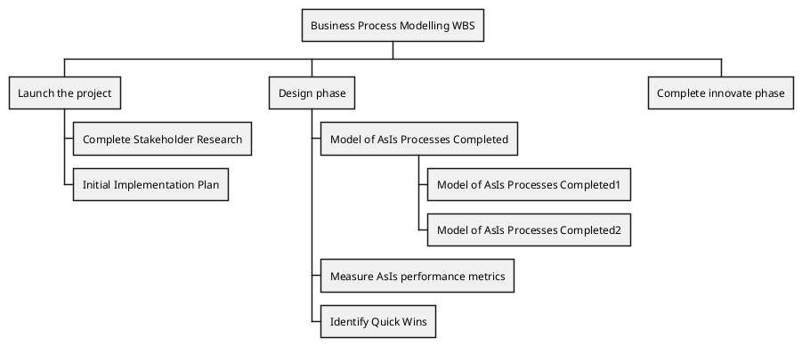
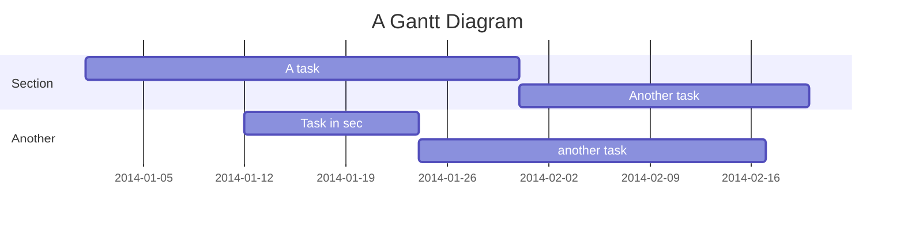
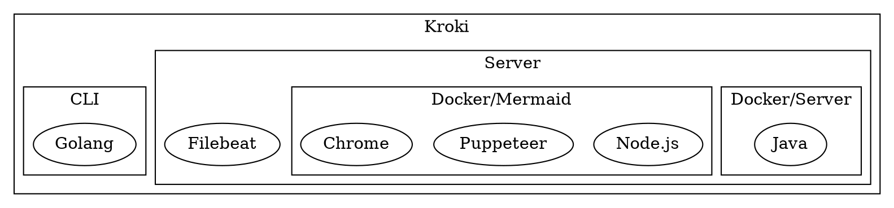

# Kroki diagrams (Simple)

## Sequence diagram (PlantUML)



## Sequence diagram (Mermaid)



## Sequence diagram (SeqDiag)

```seqdiag
seqdiag {
  browser  -> webserver [label = "GET /index.html"];
  browser <-- webserver;
  browser  -> webserver [label = "POST /blog/comment"];
  webserver  -> database [label = "INSERT comment"];
  webserver <-- database;
  browser <-- webserver;
}
```

## Activity diagram (PlantUML)



## Activity diagram (ActDiag)

```actdiag
actdiag {
  write -> convert -> image

  lane user {
    label = "User"
    write [label = "Writing reST"];
    image [label = "Get diagram IMAGE"];
  }
  lane actdiag {
    convert [label = "Convert reST to Image"];
  }
}
```

## UML diagram (Nomnoml)

```nomnoml
[Pirate|eyeCount: Int|raid();pillage()|
  [beard]--[parrot]
  [beard]-:>[foul mouth]
]

[<abstract>Marauder]<:--[Pirate]
[Pirate]- 0..7[mischief]
[jollyness]->[Pirate]
[jollyness]->[rum]
[jollyness]->[singing]
[Pirate]-> *[rum|tastiness: Int|swig()]
[Pirate]->[singing]
[singing]<->[rum]

[<start>st]->[<state>plunder]
[plunder]->[<choice>more loot]
[more loot]->[st]
[more loot] no ->[<end>e]

[<actor>Sailor] - [<usecase>shiver me;timbers]
```

## Entity Relationship Diagram (Erd)

```erd
[Person]
*name
height
weight
+birth_location_id

[Location]
*id
city
state
country

Person *--1 Location
```

## Use case diagram (PlantUML)



## MindMap (PlantUML)



## Work Breakdown Structure (PlantUML)



## Gantt (Mermaid)



## Digital Timing diagram (WaveDrom)

```wavedrom
{ signal: [
  { name: "clk",         wave: "p.....|..." },
  { name: "Data",        wave: "x.345x|=.x", data: ["head", "body", "tail", "data"] },
  { name: "Request",     wave: "0.1..0|1.0" },
  {},
  { name: "Acknowledge", wave: "1.....|01." }
]}
```

## Block diagram (BlockDiag)

```blockdiag
blockdiag {
  blockdiag -> generates -> "block-diagrams";
  blockdiag -> is -> "very easy!";

  blockdiag [color = "greenyellow"];
  "block-diagrams" [color = "pink"];
  "very easy!" [color = "orange"];
}
```

## Network diagram (NwDiag)

```nwdiag
nwdiag {
  network dmz {
    address = "210.x.x.x/24"

    web01 [address = "210.x.x.1"];
    web02 [address = "210.x.x.2"];
  }
  network internal {
    address = "172.x.x.x/24";

    web01 [address = "172.x.x.1"];
    web02 [address = "172.x.x.2"];
    db01;
    db02;
  }
}
```

## Packet diagram (PacketDiag)

```packetdiag
packetdiag {
  colwidth = 32;
  node_height = 72;

  0-15: Source Port;
  16-31: Destination Port;
  32-63: Sequence Number;
  64-95: Acknowledgment Number;
  96-99: Data Offset;
  100-105: Reserved;
  106: URG [rotate = 270];
  107: ACK [rotate = 270];
  108: PSH [rotate = 270];
  109: RST [rotate = 270];
  110: SYN [rotate = 270];
  111: FIN [rotate = 270];
  112-127: Window;
  128-143: Checksum;
  144-159: Urgent Pointer;
  160-191: (Options and Padding);
  192-223: data [colheight = 3];
}
```

## Line Chart (Vega-Lite)

```vegalite
{
  "$schema": "https://vega.github.io/schema/vega-lite/v5.json",
  "data": {
    "values": "date,price\nAug 1 2004,102.37\nSep 1 2004,129.6\nOct 1 2004,190.64\nNov 1 2004,180.64\nDec 1 2004,160.12\nJan 1 2005,136.23\nFeb 1 2005,95.36",
    "format": {
      "type": "csv"
    }
  },
  "mark": "line",
  "encoding": {
    "x": {"field": "date", "type": "temporal"},
    "y": {"field": "price", "type": "quantitative"}
  }
}
```

## Hardware structure/behavior (Symbolator)

```symbolator
module demo_device #(
    //# {{}}
    parameter SIZE = 8,
    parameter RESET_ACTIVE_LEVEL = 1
) (
    //# {{clocks|Clocking}}
    input wire clock,
    //# {{control|Control signals}}
    input wire reset,
    input wire enable,
    //# {{data|Data ports}}
    input wire [SIZE-1:0] data_in,
    output wire [SIZE-1:0] data_out
);
  // ...
endmodule
```

## GraphViz (DOT)



## Wiring system (WireViz)

```wireviz
connectors:
  X1:
    type: D-Sub
    subtype: female
    pinlabels: [DCD, RX, TX, DTR, GND, DSR, RTS, CTS, RI]
  X2:
    type: Molex KK 254
    subtype: female
    pinlabels: [GND, RX, TX]

cables:
  W1:
    gauge: 0.25 mm2
    length: 0.2
    color_code: DIN
    wirecount: 3
    shield: true

connections:
  -
    - X1: [5,2,3]
    - W1: [1,2,3]
    - X2: [1,3,2]
  -
    - X1: 5
    - W1: s
```
